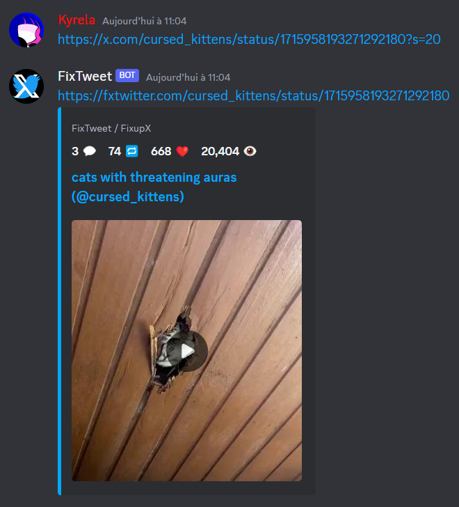

<span>
    <h1>
        
        FixTweetBot
    </h1>
</span>

[](https://discord.com/oauth2/authorize?client_id=1164651057243238400)
[](https://top.gg/bot/1164651057243238400)
[](https://top.gg/bot/1164651057243238400)


FixTweetBot is a Discord bot that fixes Twitter embeds, using the
[FixTweet](https://github.com/FixTweet/FixTweet) service.

In concrete terms, this bot automatically repost `x.com`, `twitter.com` and `nitter.net` posts as `fxtwitter` ones.

## Usage

Simply send a message containing a Twitter link, and the bot will remove the twitter embed if any and automatically
repost it as a `fxtwitter` link.



You can disable or enable the bot in a channel by using the `/disable` and `/enable` commands.

You also can ignore a link by putting it between `<` and `>`, like this: `<https://twitter.com/...>`.

## Add the bot to your server

You can add the bot to your server by clicking on the following
link: [Invite link](https://discord.com/oauth2/authorize?client_id=1164651057243238400)
or view it from the [Discord App Directory](https://discord.com/application-directory/1164651057243238400)

Please also consider upvoting the bot on [Tog.gg](https://top.gg/bot/1164651057243238400)!

The bot is also available on
[Discord Bots](https://discord.bots.gg/bots/1164651057243238400) and
[Discord Bot List](https://discord.ly/fixtweet).

## Comparison with other bots

|                                                          | FixTweetBot                              | [LinkFix](https://github.com/podaboutlist/linkfix-for-discord) | [Dystopia](https://top.gg/bot/1038138572613619793)                    | [EmbedEz](https://embedez.com)                                                                                                        | [Nano Embedding](https://discord.com/application-directory/978552836105326592)              | [Keto](https://github.com/stekc/Keto-Bot)                                         | [ComebackTwitterEmbed](https://top.gg/fr/bot/1161267455335862282)                                                                                | [TweetFixer](https://top.gg/fr/bot/1177042905622396928) | [VxT](https://top.gg/fr/bot/1015497909925580830)                                                                             |
|----------------------------------------------------------|------------------------------------------|----------------------------------------------------------------|-----------------------------------------------------------------------|---------------------------------------------------------------------------------------------------------------------------------------|---------------------------------------------------------------------------------------------|-----------------------------------------------------------------------------------|--------------------------------------------------------------------------------------------------------------------------------------------------|---------------------------------------------------------|------------------------------------------------------------------------------------------------------------------------------|
| App commands support                                     | ✓                                        | /                                                              | ✓                                                                     | ✓                                                                                                                                     | ✓                                                                                           | ✓                                                                                 | ✓                                                                                                                                                | ✓                                                       | ✓                                                                                                                            |
| Permissions asked                                        | Minimum                                  | Unused ones                                                    | Unused ones                                                           | Privacy violating (ability to read message history, force you to join servers, use other bots commands, read your email address, etc) | Minimum one except for "use other bots' commands" and "modify server's emojis and stickers" | Privacy violating and abusive write permissions (manage threads, emojis, members) | Not enough                                                                                                                                       | Not enough                                              | Extremely abusive, both for privacy and for writing permissions (read history, ping everyone, manage entities, join VC, etc) |
| Languages support                                        | fr, en                                   | /                                                              | en                                                                    | en                                                                                                                                    | en                                                                                          | en                                                                                | en, jp                                                                                                                                           | en                                                      | en                                                                                                                           |
| Service used                                             | fxtwitter                                | fxtwitter                                                      | vxtwitter                                                             | Home-made (embedez.com)                                                                                                               | home-made. False positive on already-fixed links.                                           | vxtwitter                                                                         | home-made, reply to bots                                                                                                                         | fxtwitter                                               | fxtwitter or any proxy services you want                                                                                     |
| Modifications on the base message                        | remove the embed                         | ✕                                                              | delete the message                                                    | ✕                                                                                                                                     | remove the embed                                                                            | remove the embed                                                                  | nothing OR deleted message if only a link is provided in it                                                                                      | remove embed                                            | delete message OR nothing                                                                                                    |
| New message                                              | fixed links in hypertext                 | replying (without mention), fixed links                        | indicate the author, repost the full message content with fixed links | fixed link                                                                                                                            | reply with an embed, with a second embed containing the video if any.                       | For each  link, reply with the fixed link.                                        | For each link, send OR reply with an embed with separated video and for each quoted tweet reply with same, photos in the embed OR as attachments | author's mention + message content with fixed links     | repost message content with fixed links OR re-create the message using webhooks with fixed links                             |
| Ignore non-embeddable links                              | ✓                                        | ✕                                                              | ✕                                                                     | ✕                                                                                                                                     | only <>                                                                                     | ✕                                                                                 | Only spoilers and <>                                                                                                                             | ✕                                                       | ✕                                                                                                                            |
| Possibility for original author to delete the bot's post | ✕                                        | ✕                                                              | ✕                                                                     | ✕                                                                                                                                     | ✓                                                                                           | ✕                                                                                 | ✓                                                                                                                                                | ✕                                                       | ✓ (for everyone, vote-based)                                                                                                 |
| Open-sourced                                             | ✓                                        | ✓                                                              | ✕                                                                     | ✕                                                                                                                                     | ✕                                                                                           | ✓                                                                                 | ✕                                                                                                                                                | ✕                                                       | ✕                                                                                                                            |
| Other services support                                   | ✕                                        | Youtube Shorts, TikTok, Instagram, Reddit, Pixiv               | TikTok, Reddit, Instagram                                             | Tiktok, Instagram, Reddit                                                                                                             | Bluesky, Instagram, TikTok, Pixiv, DeviantArt, Fur Affinity, e621, Newgrounds               | TikTok, Instagram, Reddit                                                         | ✕                                                                                                                                                | ✕                                                       | Instagram, Tiktok, any website you want using proxies                                                                        |
| Business model                                           | Free                                     | Free                                                           | Free                                                                  | Freemium                                                                                                                              | Free, donations accepted                                                                    | Free                                                                              | Free                                                                                                                                             | Free                                                    | Free                                                                                                                         |
| Other features                                           | Nitter support, ignore specific channels | ✕                                                              | ✕                                                                     | website interface, download system                                                                                                    | download system                                                                             | ✕                                                                                 | ignore posts with specific words, from specific user, role or channel, tweets translation                                                        | ✕                                                       | ignore posts from specific user, role or channel, tweets translation                                                         |
| ________________________________________________________ | ________________________                 | ____________________________                                   | ______________________________                                        | ____________________________________________________                                                                                  | ______________________________________________                                              | _______________________________________                                           | ________________________________________________________________                                                                                 | ______________________                                  | ________________________________________________                                                                             |

_Do you know of another similar bot that is not included here? Feel free to open an issue!_

## Self-hosting

Simply install Python >= 3.10, clone the repository, and run `pip install -r requirements.txt`.

Be sure to have a database set up using MySQL.

Then, create a `override.config.yml` file containing the following:

```yaml
token: <your_personal_token>
dev_guild: <your_personnal_guild_id> # for dev commands

database:
  host: <your_database_host>
  driver: <your_database_driver>
  database: <your_database_name>
  user: <your_database_user>
  password: <your_database_password>
  port: <your_database_port>
```

You can also override any other config value from `config.yml` in this file.
You might also want to modify other configuration options. More information about how to do it
on [discore](https://github.com/Kyrela/discore).

Now, initialize the database by running `masonite-orm migrate -C database/config.py -d database/migrations`.

Finally, run `python main.py`.

## Get help

If you need help, you can join the [support server](https://discord.gg/3ej9JrkF3U) or open an issue.

## Links

- [Source code](https://github.com/Kyrela/FixTweetBot) (please leave a star!)
- [Original FixTweet Project](https://github.com/FixTweet/FixTweet) (We are not affiliated in any way, but please
  support their work!)
- [Discord App Directory page](https://discord.com/application-directory/1164651057243238400)
- [Top.gg page](https://top.gg/bot/1164651057243238400) (please leave an upvote!)
- [Support server](https://discord.gg/3ej9JrkF3U)
- [Invite link](https://discord.com/oauth2/authorize?client_id=1164651057243238400)
- [Discord Bots page](https://discord.bots.gg/bots/1164651057243238400)
- [Discord Bot List page](https://discord.ly/fixtweet)

## Additional Credits

- [FixTweet](https://github.com/FixTweet/FixTweet/), the service used to fix Twitter embeds, by the
  [FixTweet team](https://github.com/FixTweet)
- All maintainers of packages listed in [requirements.txt](requirements.txt)
